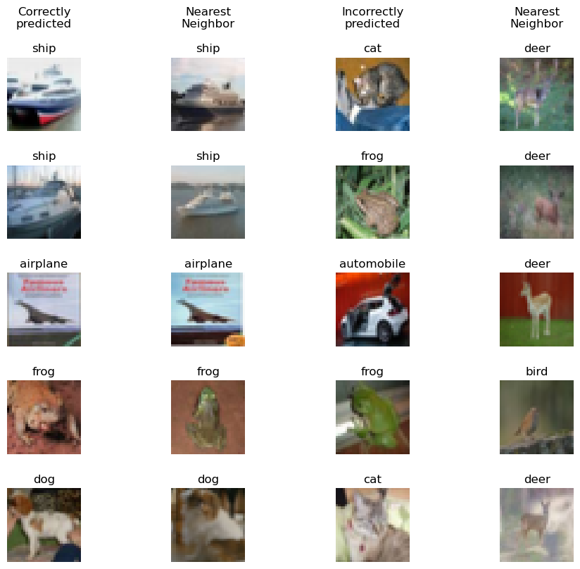
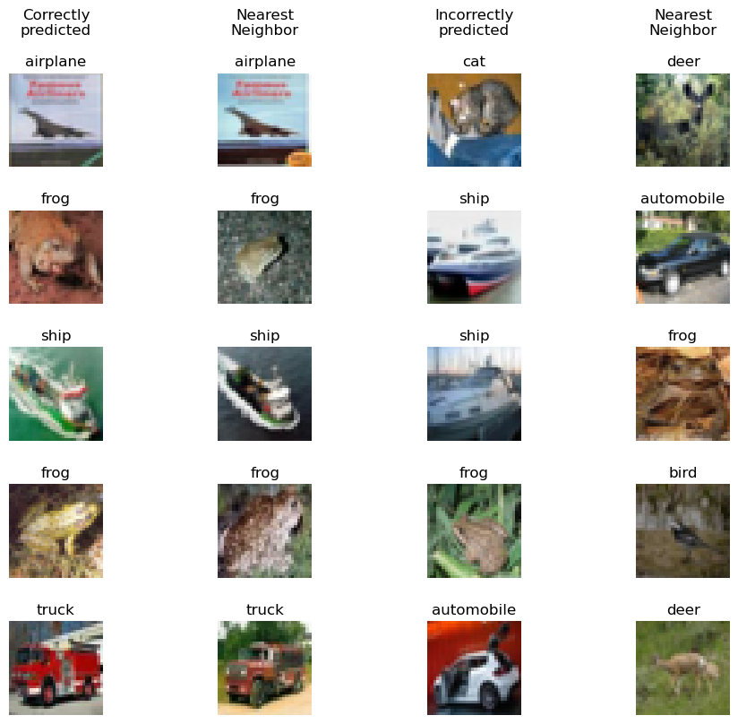
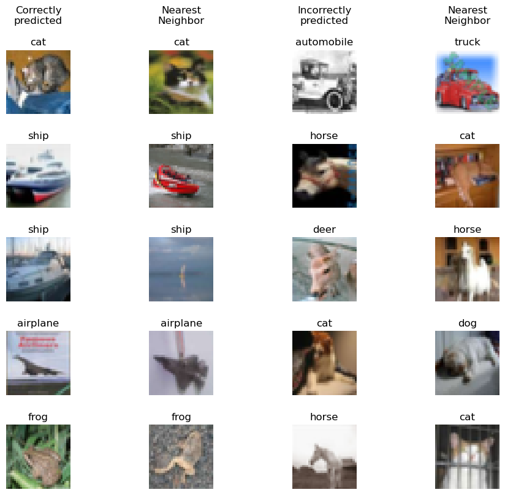

# CIFAR-representations
Choosing representations for nearest neighbor.

This repo shows how different representations of images can affect the performance of nearest-neighbor methods. Here, the CIFAR-10 data set is used, which has 50,000 training images and 10,000 test images, with ten different classes (airplane, automobile, bird, cat, deer, dog, frog, horse, ship, truck). The images are in color, of size 32×32.

Several image representations will be compared:

* The raw pixel representation
* Histogram-of-gradients (HoG) features
* The representation obtained by passing the image through a pre-trained convolutional net (VGG) and using one of the last layers (last-fc, meaning “last fully-connected layer”)
* The representation obtained by passing the image through a pre-trained convolutional net (VGG) and using one of the earlier layers (last-conv, meaning “last convolutional layer”)
* The representation obtained by using a convolutional net with the same architecture but with random weights (and again, with two variants, last-fc and last-conv)

In each case, the idea is to study the classification performance (on the test set) using 1-nearest neighbor on the training data with Euclidean (L2) distance.

The following table shows dimensionality of representations

| Representation | Dimensions |
| --- | --- |
| Raw pixel | 3072 |
| HoG | 512 |
| VGG-last-fc | 4096 |
| VGG-last-conv | 512 |

The following table shows test accuracies for 1-nearest neighbor classification using various representations

| Representation | Test accuracy |
| --- | --- |
| Raw pixel | 0.3539 |
| HoG | 0.3657 |
| VGG-last-fc | 0.9207 |
| VGG-last-conv | 0.92 |
| Random-VGG-last-fc | 0.39 |
| Random-VGG-last-conv | 0.4005 |

The following figures depict Images in the test set with correctly and incorrectly predicted labels and their nearest neighbors

Raw pixel representation

HoG representation

VGG-last-fc representation

